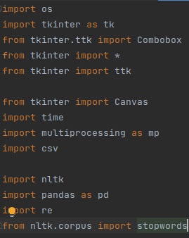

# Multiprocessing Kullanılarak Bir Milyon Satırlık Veri Setinte Filtreleme İşlemleri

## Özet
Bu projede bir milyon satırlık veri setindeki verilerin belirli bir benzerlik oranı bulma formülüne göre filtrelenmesi işlemi yapılacaktır. 
Bu işlem için multiprocessing kütüphanesi kullanıldı.
Bu kütüphane ile veri setindeki verilerin filtrelenmesi işlemi paralel olarak yapılacaktır. 
Bu sayede işlem daha hızlı bir şekilde gerçekleştirildi.
Proje isterleri proje dosyasına eklenen pdf dosyasında detaylı olarak açıklanmıştır.
### Veri Seti

Veri setimiz 1 milyon satırdan fazla veri içermektedir. 
Bu veriler bir müşteri şikayet kayıtlarının tutulduğu bir veri tabanı. 
Veri seti pre-processing yapılarak kullanıma hazır hale getirilmiştir.
Ham verileri içeren dosya rows.csv dosyasıdır.
Bu dosyayı kullanarak veri seti oluşturulmuştur.
Pre-processing işlemlerinden geçen dosya rows2.csv dosyasıdır.
Ancak dosya boyutu sınırı sebebiyle .zip olarak dosyaya ekledim.Zipten çıkalırıp proje içine eklenirse çalışacaktır.
Benzerlik oranlarının bulunması için her sütundaki tekrarsız verileri içeren dosyalar sütun isimleriyle
aynı isimde oluşturulmuş ve sutunlar klasörü içerisinde bulunmaktadır. Bu adım karşılaşılan problemler başlığında anlatıldı.

### İstenenler

Veri seti üzerinde çeşitli senaryolara göre filtreleme işlemleri yapmamız ve sonuçlarını bir arayüzde göstermemiz gerekiyordu.
Sonuçlar filtreleme sonucunda gelen veriler, işlemlerin tek tek süreleri ve toplam süreleri olmak üzere iki kısımdan oluşuyordu.

### Karşılaşılan problemler ve çözüm yöntemleri

Veri seti oldukça büyük olduğu için benzerlik oranı bulma işlemi eğer dosyayı baştan sona okuyarak yapılırsa çok uzun sürüyordu.
Bu işlemi multiprocess kullanarak yapılsa bile işlem hala uzun sürüyor, saatleri buluyordu. Bu sorunu çözmek için veri setini incelerken 
oldukça fazla tekrar eden veri olduğu görüldü. 
Tekrar eden veriler zaten pre-procesing işleminde kaldırılmıştı. Bu tekrar etme durumu farklı şikayet kayıtlarında kolon bazında bir tekrar etmeydi.
Benzerlik arama işlemini tekrarsız verileri üzerinden yapmaya karar verdim. 
Önce dosyayı baştan sonra okuyup tekrarsız verileri ortaya çıkardım.
Sutunlar isimli dosyada bu tekrarsız verileri tuttum ve benzerlik oranını bulma işlemini bu dosyalar üzerinden yaptım.
Bu oldukça fazla vakit kazandırdı ve işlemler saniyelere düştü.

## Kullanılan Kütüphaneler

## Senaryoların Oluşturulduğu ve Programın Çalıştırıldığı Arayüz
Arayüz tkinter kütüphanesi kullanılarak oluşturuldu. Arayüzde 3 farklı ana senaryo bulunmaktadır.
Bu senaryolar kendi içlerinde farklılaştırılıp yeni senaryolar oluşturulabilir.

## Sonuç Ekranları

